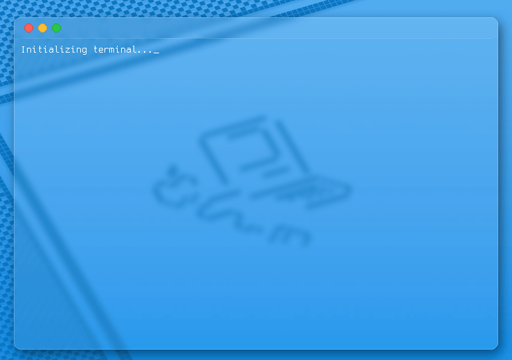

<div align="center">

# Terminal GIF for GitHub Profile

**An animated terminal GIF showcasing your GitHub stats — auto-generated daily.**



[](https://github.com/dbuzatto/gif-terminal/stargazers)
[](https://github.com/dbuzatto/gif-terminal/network/members)
[](LICENSE)

</div>

---

## Features

- Fetches **real-time GitHub stats** (commits, stars, PRs, followers, rank, languages)
- **Three themes** — classic terminal, macOS Liquid Glass, or Debian GNOME
- **Username auto-detected** — no code editing needed after forking
- **Auto-regenerated daily** via GitHub Actions
- Easy to set up: fork → configure two settings → done

---

## Themes

| Value | Theme | Description |
|-------|-------|-------------|
| `default` | **Classic dark** *(default)* | Clean dark terminal, no wallpaper |
| `macos` | **macOS Liquid Glass** | Frosted glass terminal floating over a macOS wallpaper, with traffic-light buttons |
| `debian` | **Debian GNOME** | Classic GNOME 2 terminal with title bar, menu bar, and Tango colors over the Debian wallpaper |

---

## Quick Start (fork & use)

### 1. Fork this repository

Click the **Fork** button at the top right of this page.

### 2. Add your GitHub Token

Go to **Settings → Secrets and variables → Actions** and add a new **secret**:

| Name | Value |
|------|-------|
| `GH_TOKEN` | Your GitHub Personal Access Token |

> Generate a token at [github.com/settings/tokens](https://github.com/settings/tokens) — only the `read:user` scope is needed.

### 3. Choose your theme

Go to **Settings → Secrets and variables → Actions**, open the **Variables** tab and click **New repository variable**:

| Name | Value |
|------|-------|
| `THEME` | `macos` or `debian` or `default` |

> If you skip this step the `default` theme (classic dark terminal, no wallpaper) is used.

### 4. (macOS / Debian themes) Add your wallpaper

| Theme | File to replace |
|-------|----------------|
| `macos` | `assets/macos_wallpaper.jpg` |
| `debian` | `assets/debian_wallpaper.png` |

Replace the file in `assets/` with your own image. Any resolution works — it will be cropped to fit automatically.

### 5. Trigger the first run

Go to **Actions → Generate Terminal GIF → Run workflow** to generate your first GIF immediately, or wait for the daily schedule (06:00 UTC).

### 6. Add to your profile README

```markdown

```

---

## Running Locally

### Install dependencies

```bash
pip install github-readme-terminal requests python-dotenv Pillow

# Install ffmpeg (macOS)
brew install ffmpeg

# Install ffmpeg (Ubuntu / Debian)
sudo apt install ffmpeg
```

> **No ffmpeg?** The scripts include a PIL fallback — the GIF will still be generated.

### Configure your GitHub Token and username

```bash
cp .env.example .env
```

Edit `.env` and fill in both values:

```env
GITHUB_TOKEN=your_token_here
GIT_USERNAME=your_github_username   # required for local runs
```

> On GitHub Actions the username is auto-detected — `GIT_USERNAME` is only needed when running locally.

### Generate the GIF

```bash
# macOS Liquid Glass theme
python generate_liquid_glass.py

# Debian GNOME theme
python generate_debian.py

# Classic dark theme
python generate_with_stats.py
```

The output is saved as `output.gif`.

---

## Project Structure

```
.
├── generate_liquid_glass.py      # macOS Liquid Glass theme
├── generate_debian.py            # Debian GNOME theme
├── generate_with_stats.py        # Classic dark theme
├── assets/
│   ├── macos_wallpaper.jpg       # Wallpaper for macOS theme
│   └── debian_wallpaper.png      # Wallpaper for Debian theme
├── output.gif                    # Generated GIF (auto-updated by CI)
├── .env.example                  # Environment variable template
└── .github/
    └── workflows/
        └── generate-gif.yml      # Unified CI workflow (theme selected via THEME variable)
```

---

## Customization

### Username
The username is **automatically detected** from your GitHub account — no code changes needed.
When running locally, you can override it with:
```bash
GIT_USERNAME=your-username python generate_liquid_glass.py
```

### Skills and content
All three scripts share the same `skills` list and stats sections. Edit whichever script you use.

### Theme-specific settings

**macOS Liquid Glass** (`generate_liquid_glass.py`)
- Wallpaper → replace `assets/macos_wallpaper.jpg`
- Glass opacity → `frosted_title` / `frosted_content` overlay alpha in `prepare_glass_layers()`
- Text colors → `ConvertAnsiEscape.ANSI_ESCAPE_MAP_TXT_COLOR` at the top of the file

**Debian GNOME** (`generate_debian.py`)
- Wallpaper → replace `assets/debian_wallpaper.png`
- Glass darkness → `tint_rgba` values in `prepare_debian_layers()`
- Text colors → `ConvertAnsiEscape.ANSI_ESCAPE_MAP_TXT_COLOR` at the top of the file
- Window layout → `TITLE_H`, `MENU_H`, `CORNER_RADIUS` constants

---

## Contributing

Contributions, issues, and feature requests are welcome.
Feel free to open an [issue](../../issues) or submit a pull request.

---

<div align="center">

If this project helped you, consider leaving a ⭐

</div>
